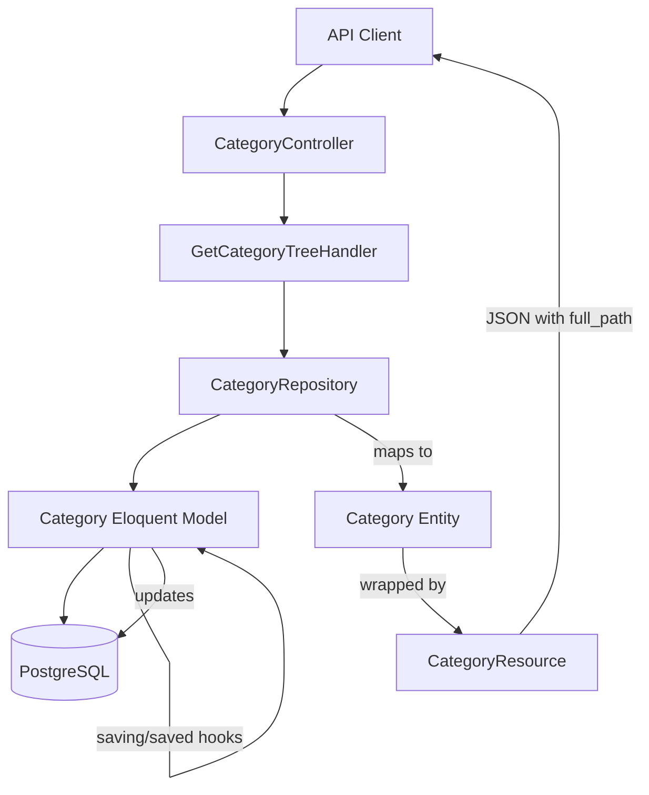

# Requirements

### Overview & Goals
The goal is to implement a `full_path` field for categories that represents the full hierarchy path (e.g., `parent/child/grandchild`) using slugs. This path will be used for navigation and displayed in product resources.

### Scope
- **Backend**: Update database schema, Eloquent models, Domain entities, and Repositories.
- **API**: Include `full_path` in `CategoryResource` and `ProductResource`.
- **Tree Rendering**: Ensure the `full_path` is available when rendering category trees.
- **Automation**: Automatically update `full_path` when a category is moved or its slug changes.

### User Stories
- As an API consumer, I want to see the full path of a category so that I can generate correct URLs for navigation.
- As a frontend developer, I want to have the `full_path` pre-calculated in the category tree to easily implement routing to category products.
- As a user browsing products, I want to see the full category path of a product to understand its context in the catalog.

# Technical Design

### Current Implementation
- Categories use `lazychaser/laravel-nestedset` for hierarchy management.
- Slugs are managed by `spatie/laravel-sluggable`.
- Domain entities are separated from Eloquent models.
- `CategoryResource` currently only supports `children` if an Eloquent model is passed.

### Proposed Changes
- **Database**: Add `full_path` (string, nullable) to `categories` table.
- **Eloquent Model (`Category`)**:
    - Hook into `saving` to update `full_path` for the current record.
    - Hook into `saved` to recursively update descendants if the path changed.
    - Method `generateFullPath()`:
      ```php
      public function generateFullPath(): string
      {
          $ancestors = $this->ancestors()->pluck('slug')->toArray();
          return implode('/', array_merge($ancestors, [$this->slug]));
      }
      ```
- **Domain Entities**:
    - `Category`: add `fullPath` and `children`.
    - `Product`: add `categoryFullPath`.
- **Repositories**:
    - `EloquentCategoryRepository`: Populate `fullPath` and recursive `children`.
    - `EloquentProductRepository`: Load category to get `full_path`.
- **Resources**:
    - `CategoryResource`: Add `full_path`. Support `children` from entity.
    - `ProductResource`: Add `category_full_path`.

### Architecture Diagram


### Risks
- **Performance**: Updating all descendants on move could be slow if the tree is very deep. However, for typical category trees, this is acceptable.
- **Synchronization**: Ensuring `full_path` stays in sync with `slug` and `parent_id` changes.

# Testing

### Validation Approach
- Use existing `tests/Feature/CategoryTest.php` as a base.
- Add new test cases for `full_path` verification.

### Key Scenarios
1. **New Category**: Create a root category, verify `full_path` is its slug.
2. **Nested Category**: Create a child category, verify `full_path` is `parent/child`.
3. **Move Category**: Change a category's parent, verify `full_path` of it and all its children are updated.
4. **Rename Category**: Change a category's name (and thus slug), verify `full_path` updates.
5. **Product Resource**: Fetch a product and verify it contains `category_full_path`.

# Delivery Steps

### ✓ Step 1: Create migration for full_path in categories table
- Create a new migration file `database/migrations/xxxx_xx_xx_xxxxxx_add_full_path_to_categories_table.php`.
- Add a nullable string column `full_path` to the `categories` table.
- Implement the `up` method to add the column and the `down` method to remove it.
- Run the migration using `./vendor/bin/sail artisan migrate`.

### ✓ Step 2: Update Category and Product Domain Entities
- Add `public string $fullPath` and `public array $children = []` to `App\Domain\Entities\Category`.
- Add `public ?string $categoryFullPath = null` to `App\Domain\Entities\Product`.
- Ensure constructors are updated to accept these new properties.

### ✓ Step 3: Implement full_path generation logic in Category Eloquent model
- Add `full_path` to the `$fillable` array in `App\Infrastructure\Persistence\Eloquent\Category`.
- Implement a `generateFullPath()` method that concatenates ancestor slugs and the current slug.
- Add model hooks (`saving` and `saved`) to automatically update `full_path` for the current category and its descendants.
- Create a console command or seeder to populate `full_path` for existing records.

### ✓ Step 4: Update Repositories to handle full_path and children
- Update `toEntity` in `EloquentCategoryRepository` to populate `fullPath` and recursively populate `children`.
- Update `toEntity` in `EloquentProductRepository` to populate `categoryFullPath` by accessing the related category's `full_path`.
- Ensure eager loading is used where appropriate to avoid N+1 queries.

### ✓ Step 5: Update Resources and verify changes with tests
- Add `full_path` to `App\Http\Resources\CategoryResource` and ensure it handles `children` from both models and entities.
- Add `category_full_path` to `App\Http\Resources\ProductResource`.
- Optionally update Filament's `CategoriesTable` to show the full path.
- Update `tests/Feature/CategoryTest.php` to verify the new functionality.