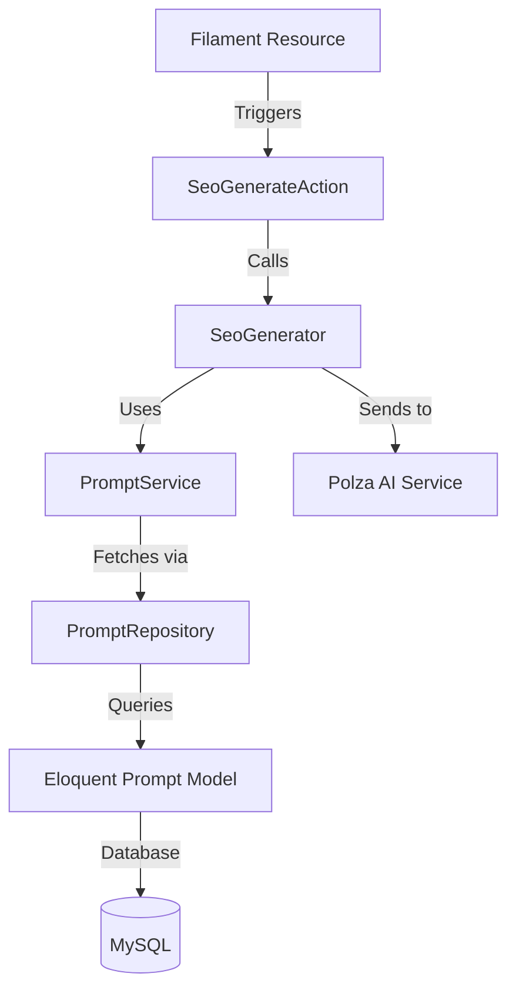

# Requirements

### Overview & Goals
Implement a flexible system for managing SEO generation prompts (rules) in the database. This allows administrators to customize AI generation rules for different types of content (Products, Categories, Posts, Pages) and define general system-wide rules without changing the code.

### Scope
- **Database**: New `prompts` table to store rules per category.
- **Domain**: New `PromptCategory` enum and `Prompt` entity.
- **Infrastructure**: Eloquent model and repository for `Prompt`.
- **Application**: `PromptService` to handle prompt logic and updates to `SeoGenerator`.
- **Presentation**: Filament resource for managing prompts and updated SEO generation actions in existing forms.

### Functional Requirements
- Ability to create, read, update, and delete prompts for specific categories.
- Support for `General`, `Category`, `Products`, `Posts`, and `Page` categories.
- Active/Inactive status for each prompt.
- SEO generation must combine the `General` prompt with the specific category prompt.
- SEO generation must fall back to hardcoded defaults if no active prompts are found in the database.

# Technical Design

### Current Implementation
- `SeoGenerator` uses a hardcoded system prompt and a hardcoded user prompt with rules.
- `SeoGenerateAction` is a static action used in Filament forms that calls `SeoGenerator->generateFromText(string $text)`.
- Existing models (`Product`, `Category`, `Content`) use `HasSeo` concern and have SEO fields in their Filament forms.

### Proposed Changes
#### Domain Layer
- **`App\Domain\Enums\PromptCategory`**:
  ```php
  enum PromptCategory: string {
      case General = 'general';
      case Category = 'category';
      case Products = 'products';
      case Posts = 'posts';
      case Page = 'page';
  }
  ```
- **`App\Domain\Entities\Prompt`**: Plain object representing the rule.
- **`App\Domain\Repositories\PromptRepositoryInterface`**:
  - `getActiveByCategory(PromptCategory $category): ?Prompt`

#### Infrastructure Layer
- **`App\Infrastructure\Persistence\Eloquent\Prompt`**: Eloquent model.
- **`App\Infrastructure\Persistence\Repositories\EloquentPromptRepository`**: Repository implementation.

#### Application Layer
- **`App\Application\Services\PromptService`**:
  - `getRulesForCategory(PromptCategory $category): array`
  - Logic: Fetches `General` prompt + `category` prompt, returns rules as an array of strings.
- **`App\Application\Services\SeoGenerator`**:
  - Inject `PromptService`.
  - Update `generateFromText(string $text, PromptCategory $category)` to use dynamic rules.

#### Presentation Layer (Filament)
- **`App\Filament\Actions\SeoGenerateAction`**:
  - Modify `make()` to accept `PromptCategory | Closure`.
  - Pass the category to `SeoGenerator`.
- **`App\Filament\Resources\PromptResource`**:
  - Form with `Select` for category, `MarkdownEditor` for rule, and `Toggle` for status.

### Architecture Diagram


### File Structure
- `database/migrations/2026_08_01_000000_create_prompts_table.php`
- `app/Domain/Enums/PromptCategory.php`
- `app/Domain/Entities/Prompt.php`
- `app/Domain/Repositories/PromptRepositoryInterface.php`
- `app/Infrastructure/Persistence/Eloquent/Prompt.php`
- `app/Infrastructure/Persistence/Repositories/EloquentPromptRepository.php`
- `app/Application/Services/PromptService.php`
- `app/Filament/Resources/Prompts/PromptResource.php`
- `app/Filament/Resources/Prompts/Schemas/PromptForm.php`
- `app/Filament/Resources/Prompts/Tables/PromptsTable.php`

# Testing

### Validation Approach
- **Unit Tests**: Test `PromptService` logic for combining rules.
- **Integration Tests**: Test `EloquentPromptRepository` to ensure correct retrieval of active prompts.
- **Manual UI Testing**:
  - Create prompts in Filament.
  - Verify that SEO generation in Products/Categories/Content forms uses the rules defined in the database.
  - Check that disabling a prompt removes its rules from the generation.

### Key Scenarios
1. **General + Category**: Ensure both rules are applied when generating SEO for a Category.
2. **Missing Database Rules**: Ensure the system falls back to default rules if no active prompts exist in the DB.
3. **Inactive Prompt**: Ensure rules from an inactive prompt are ignored.

# Delivery Steps

### ✓ Step 1: Initialize Prompt Domain and Database
Create the migration for the `prompts` table and define the `PromptCategory` enum and `Prompt` domain entity.

- Create migration `2026_08_01_000000_create_prompts_table.php` with `rule`, `category`, and `status` fields.
- Create `App\Domain\Enums\PromptCategory` enum with cases: `General`, `Category`, `Products`, `Posts`, `Page`.
- Create `App\Domain\Entities\Prompt` class as a domain entity.

### ✓ Step 2: Implement Prompt Infrastructure Layer
Implement the Eloquent model and repository for the `Prompt` entity.

- Create `App\Infrastructure\Persistence\Eloquent\Prompt` model with category and status casting.
- Create `App\Domain\Repositories\PromptRepositoryInterface` defining retrieval methods.
- Create `App\Infrastructure\Persistence\Repositories\EloquentPromptRepository` implementing the interface.
- Register the repository in `AppServiceProvider`.

### ✓ Step 3: Update SEO Generator with Dynamic Prompts
Implement the logic to combine prompts and update the SEO generator to use them.

- Create `App\Application\Services\PromptService` with a `getRulesForCategory` method.
- Update `App\Application\Services\SeoGenerator` to inject `PromptService`.
- Modify `SeoGenerator->generateFromText` to include fetched rules in the AI prompt.
- Add fallback logic if no rules are found in the database.

### ✓ Step 4: Integrate Prompts into Filament UI
Create the Filament resource for managing prompts and update existing forms to pass categories.

- Create `App\Filament\Resources\PromptResource` for CRUD operations on prompts.
- Update `App\Filament\Actions\SeoGenerateAction` to accept a `PromptCategory`.
- Update `ProductForm`, `CategoryForm`, and `ContentForm` to pass the appropriate category to `SeoGenerateAction`.

### ✓ Step 5: Enhance SEO Generator with Contextual Data
Update the `SeoGenerator` and `SeoGenerateAction` to include entity title and description in the generation process for better accuracy.

- Update `App\Application\Services\SeoGenerator->generateFromText` to accept an optional `$context` array.
- Modify the AI prompt construction in `SeoGenerator` to include `Title` and `Content` (or `Description`) from the context.
- Update `App\Filament\Actions\SeoGenerateAction` to fetch the entity title (and other relevant fields) using `$get` and pass them to the generator.
- Update `ProductForm`, `CategoryForm`, and `ContentForm` calls to `SeoGenerateAction::make()` to ensure context is correctly passed.