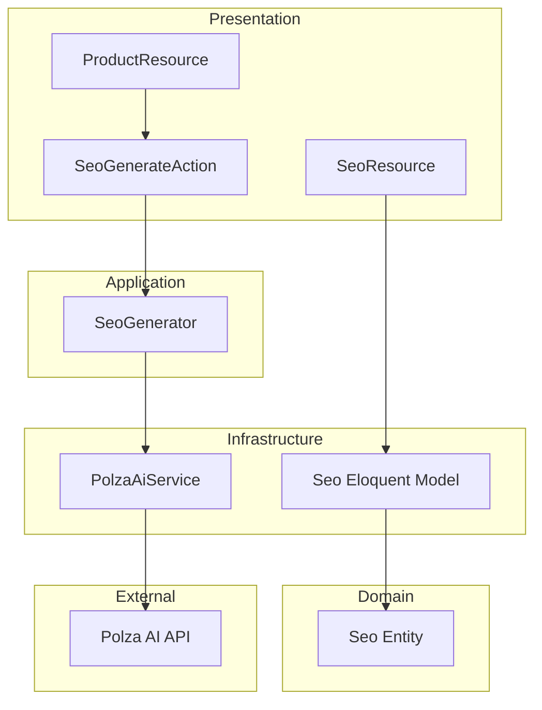

# Requirements

### Overview & Goals
Implement a robust, polymorphic SEO system that can be attached to any entity in the system (Categories, Products, Blog posts, Pages). The system will feature AI-powered SEO generation using Polza AI, allowing administrators to automatically create optimized titles and descriptions from existing content.

### Scope
- **Polymorphic SEO Engine**: A flexible model that works with any Eloquent model.
- **AI Integration**: One-click SEO generation via Polza AI (`gpt-4o-mini`).
- **Central Management**: A `SeoResource` in Filament to oversee all SEO data across the platform, organized by entity type.
- **Entity Integration**: Direct SEO editing and generation within Product, Category, and Content management pages.

### User Stories
- **As an Admin**, I want to attach SEO metadata to any category, product, or blog post so that I can improve search engine visibility.
- **As an SEO Specialist**, I want a central dashboard to see all SEO records and filter them by category or product type.
- **As a Content Manager**, I want to automatically generate SEO title and description from the product description to save time.

### Functional Requirements
- **Polymorphic Relation**: `Seo` model must link to any `seoable` entity.
- **SEO Fields**: `title`, `description`, `is_indexable` (boolean), `image` (via Media Library), `meta` (JSON).
- **Filament Action**: `SEOGenerate` action available on description fields in Filament forms.
- **SeoResource Tabs**: Grouping by "Категории", "Товары", "Блог" (and "Все").
- **AI Generation**: Call `polza.ai` API with a specialized prompt for SEO optimization.

# Technical Design

### Current Architecture
The project follows a DDD approach with a separate Infrastructure layer for Eloquent models and Persistence. Existing models like `Product`, `Category`, and `Content` use Spatie Media Library and Spatie Sluggable. Filament v5 is used for the admin panel, following a delegated structure (Schemas/Tables).

### Key Decisions
- **Polymorphic SEO**: Use a `MorphOne` relationship to allow a single SEO record per entity.
- **AI Model**: Use `gpt-4o-mini` via Polza AI for a balance of speed, cost, and quality.
- **Integration**: Use a reusable `SeoSchema` to ensure UI consistency across different resources.
- **AI Prompt**: A system prompt will guide the AI to generate a title (max 60 chars) and description (max 160 chars) based on the provided text.

### Proposed Changes
#### Domain Layer
- `App\Domain\Entities\Seo`: Domain representation of SEO data.
- `App\Domain\Repositories\SeoRepositoryInterface`: Contract for SEO persistence.

#### Infrastructure Layer
- `App\Infrastructure\Persistence\Eloquent\Seo`: Eloquent model with `HasMedia` and `seoable` relation.
- `App\Infrastructure\Persistence\Eloquent\Concerns\HasSeo`: Trait for models to enable SEO.
- `App\Infrastructure\Services\AI\PolzaAiService`: Client for Polza AI API.

#### Application Layer
- `App\Application\Services\SeoGenerator`: Logic to prepare prompts and handle AI responses.

#### Presentation Layer (Filament v5)
- `App\Filament\Resources\SeoResource`: Centralized SEO management.
- `App\Filament\Resources\Seo\Schemas\SeoSchema`: Unified SEO form components.
- `App\Filament\Actions\SeoGenerateAction`: Suffix action for AI generation.

### Architecture Diagram

# Testing

### Validation Approach
- **Unit Tests**: Verify `PolzaAiService` correctly parses AI responses and handles errors.
- **Feature Tests**: Verify the `SeoGenerateAction` updates form state in Filament.
- **Integration Tests**: Ensure SEO records are correctly created/updated when saving Products or Categories.

### Key Scenarios
- **Generate SEO**: Fill a product description, click "Generate SEO", and verify Title and Description fields are populated.
- **Manage Centralized SEO**: Open `SeoResource`, switch between "Товары" and "Категории" tabs, and verify filtering works.
- **Image Upload**: Upload an SEO image and verify it's correctly attached to the SEO model via Spatie Media Library.

# Delivery Steps

### ✓ Step 1: Setup SEO Database and Domain Models
Create the database structure and domain model for polymorphic SEO.

- Create migration for `seos` table with `seoable` polymorphic fields, `title`, `description`, `is_indexable`, `meta`.
- Create `Seo` Eloquent model in `App\Infrastructure\Persistence\Eloquent` with Spatie Media Library support.
- Create `Seo` Domain Entity in `App\Domain\Entities`.
- Create `HasSeo` trait in `App\Infrastructure\Persistence\Eloquent\Concerns` to enable SEO for other models.
- Apply `HasSeo` trait to `Category`, `Product`, and `Content` models.
- Create `SeoRepositoryInterface` and its Eloquent implementation.

### ✓ Step 2: Implement Polza AI Service and SEO Generator
Implement AI-powered SEO generation using Polza AI.

- Create `PolzaAiService` in `App\Infrastructure\Services\AI` to interact with `polza.ai` API.
- Implement `SeoGenerator` in `App\Application\Services` to orchestrate SEO generation from text descriptions.
- Add `POLZA_AI_KEY` to `.env.example`.

### ✓ Step 3: Create Filament SEO Components and Actions
Build the Filament components for SEO management and generation.

- Create `SeoSchema` in `App\Filament\Resources\Seo\Schemas` for consistent SEO fields (Title, Description, Indexability, Meta, Image).
- Create `SeoGenerateAction` in `App\Filament\Actions` as a reusable suffix action that triggers AI generation.
- Implement the logic in `SeoGenerateAction` to call the generator and update form state.

### ✓ Step 4: Implement SeoResource with Tabs and Filters
Implement the central SeoResource for managing all SEO records.

- Create `SeoResource` in `App\Filament\Resources`.
- Implement `SeosTable` with a column showing the linked entity (seoable).
- Add tabs to `ListSeos` page for "Все", "Категории", "Товары", "Блог" using `getTabs()`.
- Filter `Content` records in the "Блог" tab by `ContentType::Blog`.

### ✓ Step 5: Integrate SEO into Category, Product, and Content Resources
Integrate SEO fields and generation actions into existing resources.

- Add SEO Section with `SeoSchema` to `ProductForm`, `CategoryForm`, and `ContentForm`.
- Attach `SeoGenerateAction` to the description field in these forms.
- Update `docs/ui.md` to document the new SEO components.
- Run `vendor/bin/pint` to ensure code style compliance.