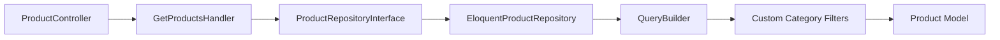

# Requirements

### Overview & Goals
Implement advanced filtering for products based on category attributes (ID, name, and full path) using `spatie/laravel-query-builder`. This follows the existing pattern used for category filtering in the project.

### Scope
- **In Scope**:
    - Filtering products by `category_id`.
    - Filtering products by `category_name` (partial match).
    - Filtering products by `category_full_path` (exact match).
    - Integration with DDD layers (Presentation -> Application -> Domain -> Infrastructure).
    - OpenAPI documentation for the new query parameters.
- **Out of Scope**:
    - Adding filters for other product attributes (unless already present).
    - Changing the product-category relationship type.

# Technical Design

### Current Implementation
- `ProductController::index` currently returns all products without filtering.
- `EloquentProductRepository::findAll` uses a simple Eloquent query.
- Categories have `id`, `name`, and `full_path` (generated by Nested Set).

### Proposed Changes
1.  **DTO**: Create `ProductFilterDTO` to encapsulate filtering logic in the Application layer.
2.  **Custom Filters**: Implement `ProductCategoryIdFilter`, `ProductCategoryNameFilter`, and `ProductCategoryFullPathFilter` in `app/Infrastructure/Persistence/Eloquent/Filters/Products`.
3.  **Repository**: Refactor `EloquentProductRepository::findAll` to use `Spatie\QueryBuilder\QueryBuilder`. It will handle the incoming `Request` (or a mock request from DTO) to apply filters.
4.  **OpenAPI**: Update `ProductController` attributes to reflect the new `filter[category_id]`, `filter[category_name]`, and `filter[category_full_path]` parameters.

### Architecture Diagram

### File Structure
- `app/Application/DTO/ProductFilterDTO.php` (New)
- `app/Infrastructure/Persistence/Eloquent/Filters/Products/` (New directory)
    - `ProductCategoryIdFilter.php`
    - `ProductCategoryNameFilter.php`
    - `ProductCategoryFullPathFilter.php`
- `app/Presentation/Controllers/Api/V1/ProductController.php` (Modified)
- `app/Infrastructure/Persistence/Repositories/EloquentProductRepository.php` (Modified)
- `tests/Feature/Api/V1/ProductFilteringTest.php` (New)

# Testing

### Validation Approach
Verification will be performed through automated feature tests and manual API calls (if possible).

### Key Scenarios
1.  **Filter by Category ID**: `GET /api/v1/products?filter[category_id]=5` should return only products belonging to category 5.
2.  **Filter by Category Name**: `GET /api/v1/products?filter[category_name]=Оборудование` should return products in categories with "Оборудование" in their name.
3.  **Filter by Full Path**: `GET /api/v1/products?filter[category_full_path]=tech/gas` should return products in that specific category path.
4.  **No Filters**: `GET /api/v1/products` should return all products as before.

# Delivery Steps

### ✓ Step 1: Create ProductFilterDTO and update GetProductsQuery/Handler
Create the DTO for product filtering and update the query object.

- Create `app/Application/DTO/ProductFilterDTO.php` using `Spatie\LaravelData\Data`.
- Update `app/Application/Queries/Products/GetProductsQuery.php` to include the filters.
- Update `app/Application/Handlers/Products/GetProductsHandler.php` to pass filters to the repository.

### ✓ Step 2: Implement custom product filters
Create invokable filter classes for Spatie Query Builder.

- Create `app/Infrastructure/Persistence/Eloquent/Filters/Products/ProductCategoryIdFilter.php`.
- Create `app/Infrastructure/Persistence/Eloquent/Filters/Products/ProductCategoryNameFilter.php`.
- Create `app/Infrastructure/Persistence/Eloquent/Filters/Products/ProductCategoryFullPathFilter.php`.
- Each filter will use `whereHas('categories', ...)` to filter products by category attributes.

### ✓ Step 3: Update Repository to support filtering
Update the repository to use QueryBuilder with the new filters.

- Update `app/Domain/Repositories/ProductRepositoryInterface.php` to accept `ProductFilterDTO`.
- Update `app/Infrastructure/Persistence/Repositories/EloquentProductRepository.php` to use `QueryBuilder::for(ProductModel::class)` in the `findAll` method.
- Register the custom filters in `allowedFilters`.

### ✓ Step 4: Update ProductController and OpenAPI documentation
Update the API controller to handle filtering and add OpenAPI documentation.

- Update `app/Presentation/Controllers/Api/V1/ProductController.php`'s `index` method.
- Map request filter inputs to `ProductFilterDTO`.
- Add `#[OA\Parameter]` definitions for the new filters to the `index` method.

### ✓ Step 5: Add Product Filtering Tests
Add feature tests to verify the new filtering functionality.

- Create `tests/Feature/Api/V1/ProductFilteringTest.php`.
- Add test cases for filtering by category ID, name, and full path.
- Verify that multiple IDs work if supported by the filter.