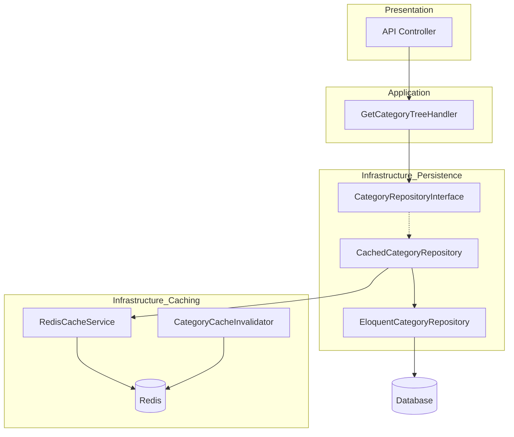

# Requirements

### Overview & Goals
The goal is to implement a robust, simple, and transparent caching layer for categories and products using Redis. This will improve application performance by reducing database load while ensuring data consistency through automatic synchronization.

### Scope
- **In Scope**:
    - Redis-based caching for all Category and Product repository read operations.
    - Automatic cache invalidation on data changes (create/update/delete).
    - Transparent integration using the Decorator pattern.
    - Configurable TTL and toggle settings.
- **Out of Scope**:
    - Caching for other entities not mentioned in the task.
    - Implementing client-side caching.

### Functional Requirements
- **Transparent Caching**: Repositories should automatically cache data without changes to the Application layer.
- **Tag-based Invalidation**: Use Redis tags to clear entire groups of cached items (e.g., all category-related data).
- **Synchronization**: Ensure cache is cleared immediately when a category or product is modified via the API or admin panel (Filament).
- **Configuration**: Allow enabling/disabling cache via environment variables.

# Technical Design

### Current Implementation
The project follows a DDD/CQRS architecture. Repositories (`EloquentCategoryRepository`, `EloquentProductRepository`) directly interact with Eloquent models. Handlers call these repositories via interfaces.

### Key Decisions
1. **Decorator Pattern**: We will wrap original repositories with cached versions. This keeps caching logic out of the core data access logic and allows for easy toggling.
    - *Rationale*: Adheres to SRP (Single Responsibility Principle) and Open/Closed Principle.
2. **Redis Tags**: We will use Laravel's cache tags (supported by Redis).
    - *Rationale*: Allows for simple invalidation of all related entries (e.g., clearing `categories` tag when any category is updated).
3. **Eloquent Observers**: Invalidation will be handled by observers.
    - *Rationale*: Ensures that even changes made outside of repositories (e.g., via Filament or Artisan commands) will trigger cache synchronization.

### Proposed Architecture


### File Structure
- `app/Infrastructure/Caching/`
    - `CacheServiceInterface.php`
    - `RedisCacheService.php`
    - `KeyGenerator.php`
- `app/Infrastructure/Persistence/Repositories/Cached/`
    - `CachedCategoryRepository.php`
    - `CachedProductRepository.php`
- `app/Infrastructure/Caching/Invalidators/`
    - `CategoryCacheInvalidator.php`
    - `ProductCacheInvalidator.php`

### Data Models / Contracts
```php
interface CacheServiceInterface
{
    public function remember(string $key, array $tags, \Closure $callback, ?int $ttl = null): mixed;
    public function invalidate(array $tags): void;
}
```

# Testing

### Validation Approach
Verification will be performed through automated tests (Pest) and manual inspection of Redis keys.

### Key Scenarios
1. **First Read**: Verify data is fetched from DB and stored in Redis.
2. **Subsequent Read**: Verify data is fetched from Redis (no DB queries).
3. **Data Update**: Verify that updating a Category/Product clears the corresponding Redis tag.
4. **Consistency**: Verify that after invalidation, the next read returns updated data from the DB.

### Edge Cases
- **Redis Down**: The system should gracefully fall back to DB calls if Redis is unavailable (handled by Laravel's cache driver if configured, or via try-catch in our service).
- **Nested Categories**: Invalidation of a parent category should clear the entire tree cache.

# Delivery Steps

### ✓ Step 1: Implement core Caching Infrastructure
Create the core caching infrastructure.
- Define `App\Infrastructure\Caching\CacheServiceInterface` for abstraction.
- Implement `App\Infrastructure\Caching\RedisCacheService` using Laravel's `Cache` facade with tag support.
- Implement `App\Infrastructure\Caching\KeyGenerator` to ensure consistent Redis keys across the application.
- Add `config/caching.php` to manage TTL and enable/disable flags for specific entities.

### ✓ Step 2: Implement Repository Decorators
Create decorators for Category and Product repositories.
- Implement `App\Infrastructure\Persistence\Repositories\Cached\CachedCategoryRepository` implementing `CategoryRepositoryInterface`.
- Implement `App\Infrastructure\Persistence\Repositories\Cached\CachedProductRepository` implementing `ProductRepositoryInterface`.
- Update `AppServiceProvider` to conditionally bind these decorators based on configuration.

### ✓ Step 3: Implement Cache Invalidation (Sync) Logic
Establish automatic cache synchronization using model events.
- Create `App\Infrastructure\Caching\Invalidators\CategoryCacheInvalidator` to listen to `Category` model events (saved, deleted).
- Create `App\Infrastructure\Caching\Invalidators\ProductCacheInvalidator` to listen to `Product` model events.
- Register these observers/listeners to ensure the cache is cleared whenever data changes.

### ✓ Step 4: Validation and Documentation
Verify the implementation with tests and documentation.
- Create feature tests to verify that data is correctly cached and invalidation works as expected.
- Generate documentation for the new caching interface using the `documentation` skill.
- Run `pint` to ensure code style compliance.