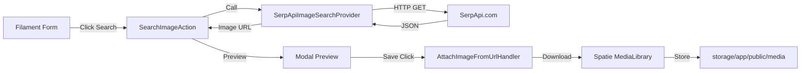

# Requirements

### Overview & Goals
Implement an image search feature using SerpApi that allows admin users to quickly find and attach images to products and categories in the Filament admin panel.

### User Stories
- **As an Admin**, I want to click a button next to a product or category name to search for images on Google.
- **As an Admin**, I want to see a preview of the first found image immediately.
- **As an Admin**, I want to save the image I liked to the model's media library with one click.

### Functional Requirements
- A reusable `SerpApiService` that interfaces with SerpApi.
- A configurable API key via the `SERP_API` environment variable.
- A reusable Filament Action `SearchImageAction` for the admin panel.
- Modal preview of the searched image.
- Automatic download and storage of the selected image using Spatie MediaLibrary.
- Support for both Products and Categories.

### Scope
- **In Scope**: SerpApi integration, Filament Action, Product and Category form integration, Image downloading and attachment.
- **Out of Scope**: Multiple image selection (only the first result is shown for now as requested), background job for downloading (synchronous download for immediate feedback).

# Technical Design

### Current Implementation
- **Filament**: Used for the admin panel.
- **Spatie MediaLibrary**: Used for handling model images (main, cover, gallery collections).
- **DDD/CQRS**: Project structure follows Domain, Application, Infrastructure layers.

### Key Decisions
- **Direct API Call**: We will call SerpApi directly via Laravel's `Http` facade as it is more reliable for this specific task.
- **Modal Preview**: Instead of immediate silent attachment, we will show a modal preview to give the user control over what is being saved.
- **CQRS for Attachment**: Using a Command/Handler for attaching media to maintain architectural consistency.

### Proposed Changes

#### 1. Configuration
- `config/services.php`: Add `serp_api` section.

#### 2. Domain Layer
- `app/Domain/Services/ImageSearchProviderInterface.php`: Generic interface for image searching.

#### 3. Infrastructure Layer
- `app/Infrastructure/Services/SerpApiImageSearchProvider.php`: Implementation of the interface using SerpApi's Google Images engine.

#### 4. Application Layer
- `app/Application/DTO/ImageSearchResult.php`: Simple data object for search results.
- `app/Application/Commands/Media/AttachImageFromUrlCommand.php`: Command to attach an image to a model.
- `app/Application/Handlers/Media/AttachImageFromUrlHandler.php`: Handler for the attachment command.

#### 5. Presentation Layer (Filament)
- `app/Filament/Actions/SearchImageAction.php`: A custom action that can be attached to any Filament form field. It will handle the modal logic, searching, and triggering the attachment handler.
- `resources/views/filament/components/image-preview.blade.php`: A simple Blade view for the modal.

#### 6. Form Integration
- Update `ProductForm` and `CategoryForm` to include the `SearchImageAction` as a suffix action on the `name` field.

### Architecture Diagram

# Testing

### Validation Approach
I will verify the implementation by:
1. Ensuring the `SerpApiService` correctly fetches image data from a mocked SerpApi response.
2. Checking that the Filament Action appears on the Product and Category forms.
3. Verifying that clicking the action opens the modal with the correct image.
4. Confirming that "Save" successfully downloads the image and attaches it to the model.

### Key Scenarios
- **Search Success**: The first image is found and displayed correctly in the modal.
- **Save Success**: The image is downloaded, attached to the `main` collection, and visible in the `SpatieMediaLibraryFileUpload` field after refresh.
- **No Results**: A message is shown if no images are found.
- **API Error**: A notification is shown if the SerpApi key is missing or the request fails.

### Edge Cases
- **Missing API Key**: Handle gracefully with a notification.
- **Invalid Image URL**: Handle download failures.
- **Empty Record**: Handle cases where the record is not yet created (e.g., disable action or provide a fallback).

# Delivery Steps

### ✓ Step 1: Implement SerpApi Service and Infrastructure
Create the necessary files for SerpApi integration.
- Add `serp_api` to `config/services.php`.
- Add `SERP_API` to `.env.example`.
- Create `ImageSearchProviderInterface` in `app/Domain/Services`.
- Create `SerpApiImageSearchProvider` in `app/Infrastructure/Services`.
- Create `ImageSearchResult` DTO in `app/Application/DTO`.

### ✓ Step 2: Implement Image Attachment Logic (CQRS)
Create the application logic to handle image attachment from a URL.
- Create `AttachImageFromUrlCommand` in `app/Application/Commands/Media`.
- Create `AttachImageFromUrlHandler` in `app/Application/Handlers/Media`.
- This handler will use `spatie/laravel-medialibrary` to download and attach the image to the specified collection.

### ✓ Step 3: Create Reusable Filament Action
Create the reusable Filament Action for image searching.
- Create `SearchImageAction` in `app/Filament/Actions`.
- Create a Blade view `resources/views/filament/components/image-preview.blade.php` for the modal preview.
- Implement the search logic within the action, using the SerpApi service.
- Implement the save logic within the action, using the attachment handler.

### ✓ Step 4: Integrate into Product and Category Forms
Integrate the new action into the existing admin forms.
- Add `SearchImageAction` as a suffix action to the `name` field in `app/Filament/Resources/Products/Schemas/ProductForm.php`.
- Add `SearchImageAction` as a suffix action to the `name` field in `app/Filament/Resources/Categories/Schemas/CategoryForm.php`.
- Verify the integration and ensure it works for both models.

### ✓ Step 5: Documentation and Code Quality
Add documentation and final touches.
- Add documentation for the new SerpApi service and Filament action in `docs/infrastructure.md` or a new file.
- Run `vendor/bin/pint` to ensure code style consistency.